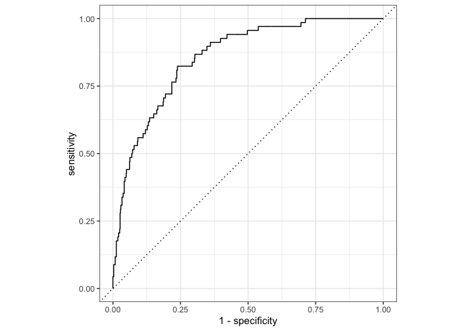

A more complex logistic model
================

## Load packages

``` r
library(openintro)
library(tidyverse)
library(tidymodels)
```

## Take a peek at the data

``` r
email
```

    ## # A tibble: 3,921 x 21
    ##    spam  to_multiple from     cc sent_email time                image attach
    ##    <fct> <fct>       <fct> <int> <fct>      <dttm>              <dbl>  <dbl>
    ##  1 0     0           1         0 0          2012-01-01 01:16:41     0      0
    ##  2 0     0           1         0 0          2012-01-01 02:03:59     0      0
    ##  3 0     0           1         0 0          2012-01-01 11:00:32     0      0
    ##  4 0     0           1         0 0          2012-01-01 04:09:49     0      0
    ##  5 0     0           1         0 0          2012-01-01 05:00:01     0      0
    ##  6 0     0           1         0 0          2012-01-01 05:04:46     0      0
    ##  7 0     1           1         0 1          2012-01-01 12:55:06     0      0
    ##  8 0     1           1         1 1          2012-01-01 13:45:21     1      1
    ##  9 0     0           1         0 0          2012-01-01 16:08:59     0      0
    ## 10 0     0           1         0 0          2012-01-01 13:12:00     0      0
    ## # … with 3,911 more rows, and 13 more variables: dollar <dbl>, winner <fct>,
    ## #   inherit <dbl>, viagra <dbl>, password <dbl>, num_char <dbl>,
    ## #   line_breaks <int>, format <fct>, re_subj <fct>, exclaim_subj <dbl>,
    ## #   urgent_subj <fct>, exclaim_mess <dbl>, number <fct>

## Predicting spam

``` r
logistic_reg() %>%
  set_engine("glm") %>%
  fit(spam ~ ., data = email, family = "binomial") %>%
  tidy()
```

    ## Warning: glm.fit: fitted probabilities numerically 0 or 1 occurred

## Performing the split

``` r
# Fix random numbers by setting the seed 
# Enables analysis to be reproducible when random numbers are used 
set.seed(1116)

# Put 80% of the data into the training set 
email_split <- initial_split(email, prop = 0.80)

# Create data frames for the two sets:
train_data <- training(email_split)
test_data  <- testing(email_split)
```

## Peek at the split

``` r
glimpse(train_data)
```

    ## Rows: 3,136
    ## Columns: 21
    ## $ spam         <fct> 0, 1, 0, 1, 0, 0, 0, 0, 0, 0, 1, 0, 0, 0, 0, 0, 0, 0, 0, …
    ## $ to_multiple  <fct> 0, 0, 0, 0, 1, 1, 0, 0, 0, 0, 0, 0, 0, 1, 0, 0, 0, 0, 0, …
    ## $ from         <fct> 1, 1, 1, 1, 1, 1, 1, 1, 1, 1, 1, 1, 1, 1, 1, 1, 1, 1, 1, …
    ## $ cc           <int> 2, 0, 0, 0, 0, 0, 0, 0, 0, 0, 0, 0, 0, 35, 0, 0, 0, 0, 0,…
    ## $ sent_email   <fct> 1, 0, 1, 0, 0, 0, 0, 0, 0, 0, 0, 0, 0, 0, 1, 0, 0, 0, 0, …
    ## $ time         <dttm> 2012-01-25 17:46:55, 2012-01-03 00:28:28, 2012-02-04 11:…
    ## $ image        <dbl> 0, 0, 0, 0, 0, 1, 0, 0, 0, 0, 0, 0, 0, 0, 0, 0, 0, 0, 0, …
    ## $ attach       <dbl> 0, 0, 0, 0, 0, 1, 0, 0, 0, 0, 0, 0, 0, 0, 0, 0, 0, 0, 0, …
    ## $ dollar       <dbl> 10, 0, 0, 0, 0, 0, 13, 0, 0, 0, 2, 0, 0, 0, 14, 0, 0, 0, …
    ## $ winner       <fct> no, no, no, no, no, no, no, yes, no, no, no, no, no, no, …
    ## $ inherit      <dbl> 0, 0, 0, 0, 0, 1, 0, 0, 0, 0, 0, 0, 0, 0, 0, 0, 0, 0, 0, …
    ## $ viagra       <dbl> 0, 0, 0, 0, 0, 0, 0, 0, 0, 0, 0, 0, 0, 0, 0, 0, 0, 0, 0, …
    ## $ password     <dbl> 0, 0, 0, 0, 0, 0, 0, 0, 0, 0, 0, 0, 0, 0, 0, 0, 3, 0, 0, …
    ## $ num_char     <dbl> 23.308, 1.162, 4.732, 42.238, 1.228, 25.599, 16.764, 10.7…
    ## $ line_breaks  <int> 477, 2, 127, 712, 30, 674, 367, 226, 98, 671, 46, 192, 67…
    ## $ format       <fct> 1, 0, 1, 1, 0, 1, 1, 1, 1, 1, 0, 1, 0, 0, 1, 1, 1, 1, 1, …
    ## $ re_subj      <fct> 1, 0, 1, 0, 0, 0, 0, 0, 0, 0, 0, 0, 1, 0, 1, 0, 0, 0, 1, …
    ## $ exclaim_subj <dbl> 0, 0, 0, 0, 0, 0, 1, 0, 0, 0, 1, 0, 0, 0, 0, 0, 0, 0, 1, …
    ## $ urgent_subj  <fct> 0, 0, 0, 0, 0, 0, 0, 0, 0, 0, 0, 0, 0, 0, 0, 0, 0, 0, 0, …
    ## $ exclaim_mess <dbl> 12, 0, 2, 2, 2, 31, 2, 0, 0, 1, 0, 1, 2, 0, 2, 0, 11, 1, …
    ## $ number       <fct> small, none, big, big, small, small, small, small, small,…

``` r
glimpse(test_data)
```

    ## Rows: 785
    ## Columns: 21
    ## $ spam         <fct> 0, 0, 0, 0, 0, 0, 0, 0, 0, 0, 0, 0, 0, 0, 0, 0, 0, 0, 0, …
    ## $ to_multiple  <fct> 1, 0, 0, 0, 0, 0, 0, 0, 0, 0, 1, 0, 0, 1, 0, 0, 0, 0, 0, …
    ## $ from         <fct> 1, 1, 1, 1, 1, 1, 1, 1, 1, 1, 1, 1, 1, 1, 1, 1, 1, 1, 1, …
    ## $ cc           <int> 0, 1, 0, 1, 4, 0, 0, 0, 0, 0, 0, 0, 0, 0, 0, 0, 0, 3, 0, …
    ## $ sent_email   <fct> 1, 1, 0, 0, 0, 0, 0, 0, 0, 0, 0, 0, 0, 0, 0, 0, 0, 1, 0, …
    ## $ time         <dttm> 2012-01-01 12:55:06, 2012-01-01 14:38:32, 2012-01-02 00:…
    ## $ image        <dbl> 0, 0, 0, 0, 0, 0, 0, 0, 0, 0, 0, 0, 0, 0, 0, 0, 1, 0, 0, …
    ## $ attach       <dbl> 0, 0, 0, 0, 0, 0, 0, 0, 0, 0, 0, 0, 0, 1, 0, 0, 1, 0, 0, …
    ## $ dollar       <dbl> 0, 0, 5, 0, 0, 0, 0, 5, 4, 0, 0, 0, 21, 0, 0, 2, 9, 0, 0,…
    ## $ winner       <fct> no, no, no, no, no, no, no, no, no, no, no, no, no, no, n…
    ## $ inherit      <dbl> 0, 0, 0, 0, 0, 0, 0, 0, 1, 0, 0, 0, 0, 0, 0, 0, 0, 0, 0, …
    ## $ viagra       <dbl> 0, 0, 0, 0, 0, 0, 0, 0, 0, 0, 0, 0, 0, 0, 0, 0, 0, 0, 0, …
    ## $ password     <dbl> 0, 0, 1, 0, 0, 0, 0, 0, 0, 1, 0, 0, 0, 0, 0, 0, 0, 0, 2, …
    ## $ num_char     <dbl> 4.837, 15.075, 18.037, 45.842, 11.438, 1.482, 14.431, 0.9…
    ## $ line_breaks  <int> 193, 354, 345, 881, 125, 24, 296, 13, 192, 14, 32, 30, 55…
    ## $ format       <fct> 1, 1, 1, 1, 0, 1, 1, 0, 1, 0, 0, 0, 1, 1, 1, 1, 1, 1, 1, …
    ## $ re_subj      <fct> 0, 1, 0, 1, 1, 0, 0, 0, 0, 0, 1, 0, 0, 0, 1, 0, 0, 1, 0, …
    ## $ exclaim_subj <dbl> 0, 0, 1, 0, 0, 0, 0, 0, 0, 0, 0, 0, 0, 0, 0, 0, 0, 0, 0, …
    ## $ urgent_subj  <fct> 0, 0, 0, 0, 0, 0, 0, 0, 0, 0, 0, 0, 0, 0, 0, 0, 0, 0, 0, …
    ## $ exclaim_mess <dbl> 1, 10, 20, 5, 2, 0, 0, 0, 6, 0, 0, 1, 3, 0, 4, 0, 1, 0, 1…
    ## $ number       <fct> big, small, small, big, small, none, small, small, small,…

## Feature engineering

-   We prefer simple models when possible, but **parsimony** does not
    mean sacrificing accuracy (or predictive performance) in the
    interest of simplicity

|                                                                                                               |
|---------------------------------------------------------------------------------------------------------------|
| \- Variables that go into the model and how they are represented are just as critical to success of the model |

-   **Feature engineering** allows us to get creative with our
    predictors in an effort to make them more useful for our model (to
    increase its predictive performance)

## Initiate a recipe

``` r
email_rec <- recipe(
  spam ~ .,          # formula
  data = train_data  # data to use for cataloguing names and types of variables
  )

summary(email_rec)
```

    ## # A tibble: 21 x 4
    ##    variable    type    role      source  
    ##    <chr>       <chr>   <chr>     <chr>   
    ##  1 to_multiple nominal predictor original
    ##  2 from        nominal predictor original
    ##  3 cc          numeric predictor original
    ##  4 sent_email  nominal predictor original
    ##  5 time        date    predictor original
    ##  6 image       numeric predictor original
    ##  7 attach      numeric predictor original
    ##  8 dollar      numeric predictor original
    ##  9 winner      nominal predictor original
    ## 10 inherit     numeric predictor original
    ## # … with 11 more rows

## Remove certain variables

``` r
email_rec <- email_rec %>%
  step_rm(from, sent_email)

email_rec
```

    ## Data Recipe
    ## 
    ## Inputs:
    ## 
    ##       role #variables
    ##    outcome          1
    ##  predictor         20
    ## 
    ## Operations:
    ## 
    ## Delete terms from, sent_email

## Feature engineer date

``` r
email_rec <- email_rec %>%
  step_date(time, features = c("dow", "month")) %>%
  step_rm(time)

email_rec
```

    ## Data Recipe
    ## 
    ## Inputs:
    ## 
    ##       role #variables
    ##    outcome          1
    ##  predictor         20
    ## 
    ## Operations:
    ## 
    ## Delete terms from, sent_email
    ## Date features from time
    ## Delete terms time

## Discretize numeric variables

``` r
email_rec <- email_rec %>%
  step_cut(cc, attach, dollar, breaks = c(0, 1)) %>%
  step_cut(inherit, password, breaks = c(0, 1, 5, 10, 20))

email_rec
```

    ## Data Recipe
    ## 
    ## Inputs:
    ## 
    ##       role #variables
    ##    outcome          1
    ##  predictor         20
    ## 
    ## Operations:
    ## 
    ## Delete terms from, sent_email
    ## Date features from time
    ## Delete terms time
    ## Cut numeric for cc, attach, dollar
    ## Cut numeric for inherit, password

## Create dummy variables

``` r
email_rec <- email_rec %>%
  step_dummy(all_nominal(), -all_outcomes())

email_rec
```

    ## Data Recipe
    ## 
    ## Inputs:
    ## 
    ##       role #variables
    ##    outcome          1
    ##  predictor         20
    ## 
    ## Operations:
    ## 
    ## Delete terms from, sent_email
    ## Date features from time
    ## Delete terms time
    ## Cut numeric for cc, attach, dollar
    ## Cut numeric for inherit, password
    ## Dummy variables from all_nominal(), -all_outcomes()

## Remove zero variance variables

Variables that contain only a single value

``` r
email_rec <- email_rec %>%
  step_zv(all_predictors())

email_rec
```

    ## Data Recipe
    ## 
    ## Inputs:
    ## 
    ##       role #variables
    ##    outcome          1
    ##  predictor         20
    ## 
    ## Operations:
    ## 
    ## Delete terms from, sent_email
    ## Date features from time
    ## Delete terms time
    ## Cut numeric for cc, attach, dollar
    ## Cut numeric for inherit, password
    ## Dummy variables from all_nominal(), -all_outcomes()
    ## Zero variance filter on all_predictors()

## All in one place

``` r
email_rec <- recipe(spam ~ ., data = email) %>%
  step_rm(from, sent_email) %>%
  step_date(time, features = c("dow", "month")) %>%               
  step_rm(time) %>%
  step_cut(cc, attach, dollar, breaks = c(0, 1)) %>%
  step_cut(inherit, password, breaks = c(0, 1, 5, 10, 20)) %>%
  step_dummy(all_nominal(), -all_outcomes()) %>%
  step_zv(all_predictors())

email_rec
```

    ## Data Recipe
    ## 
    ## Inputs:
    ## 
    ##       role #variables
    ##    outcome          1
    ##  predictor         20
    ## 
    ## Operations:
    ## 
    ## Delete terms from, sent_email
    ## Date features from time
    ## Delete terms time
    ## Cut numeric for cc, attach, dollar
    ## Cut numeric for inherit, password
    ## Dummy variables from all_nominal(), -all_outcomes()
    ## Zero variance filter on all_predictors()

## Define model

``` r
email_mod <- logistic_reg() %>% 
  set_engine("glm")

email_mod
```

    ## Logistic Regression Model Specification (classification)
    ## 
    ## Computational engine: glm

## Define workflow

``` r
email_wflow <- workflow() %>% 
  add_model(email_mod) %>% 
  add_recipe(email_rec)

email_wflow
```

    ## ══ Workflow ════════════════════════════════════════════════════════════════════
    ## Preprocessor: Recipe
    ## Model: logistic_reg()
    ## 
    ## ── Preprocessor ────────────────────────────────────────────────────────────────
    ## 7 Recipe Steps
    ## 
    ## • step_rm()
    ## • step_date()
    ## • step_rm()
    ## • step_cut()
    ## • step_cut()
    ## • step_dummy()
    ## • step_zv()
    ## 
    ## ── Model ───────────────────────────────────────────────────────────────────────
    ## Logistic Regression Model Specification (classification)
    ## 
    ## Computational engine: glm

## Fit model to training data

``` r
email_fit <- email_wflow %>% 
  fit(data = train_data)

tidy(email_fit)
```

    ## # A tibble: 31 x 5
    ##    term           estimate std.error statistic  p.value
    ##    <chr>             <dbl>     <dbl>     <dbl>    <dbl>
    ##  1 (Intercept)    -0.892     0.249     -3.58   3.37e- 4
    ##  2 image          -1.65      0.934     -1.76   7.77e- 2
    ##  3 viagra          2.28    182.         0.0125 9.90e- 1
    ##  4 num_char        0.0470    0.0244     1.93   5.36e- 2
    ##  5 line_breaks    -0.00510   0.00138   -3.69   2.28e- 4
    ##  6 exclaim_subj   -0.204     0.277     -0.736  4.62e- 1
    ##  7 exclaim_mess    0.00885   0.00186    4.75   1.99e- 6
    ##  8 to_multiple_X1 -2.60      0.354     -7.35   2.06e-13
    ##  9 cc_X.1.68.     -0.312     0.490     -0.638  5.24e- 1
    ## 10 attach_X.1.21.  2.05      0.368      5.58   2.45e- 8
    ## # … with 21 more rows

## Make predictions for test data

``` r
email_pred <- predict(email_fit, test_data, type = "prob") %>% 
  bind_cols(test_data) 
```

    ## Warning: There are new levels in a factor: NA

``` r
email_pred
```

    ## # A tibble: 785 x 23
    ##    .pred_0  .pred_1 spam  to_multiple from     cc sent_email time               
    ##      <dbl>    <dbl> <fct> <fct>       <fct> <int> <fct>      <dttm>             
    ##  1   0.995 0.00470  0     1           1         0 1          2012-01-01 12:55:06
    ##  2   0.999 0.00134  0     0           1         1 1          2012-01-01 14:38:32
    ##  3   0.967 0.0328   0     0           1         0 0          2012-01-02 00:42:16
    ##  4   0.999 0.000776 0     0           1         1 0          2012-01-02 10:12:51
    ##  5   0.994 0.00642  0     0           1         4 0          2012-01-02 11:45:36
    ##  6   0.860 0.140    0     0           1         0 0          2012-01-02 16:55:03
    ##  7   0.970 0.0296   0     0           1         0 0          2012-01-02 20:07:17
    ##  8   0.773 0.227    0     0           1         0 0          2012-01-03 00:41:35
    ##  9   0.936 0.0643   0     0           1         0 0          2012-01-03 11:02:35
    ## 10   0.809 0.191    0     0           1         0 0          2012-01-03 06:14:51
    ## # … with 775 more rows, and 15 more variables: image <dbl>, attach <dbl>,
    ## #   dollar <dbl>, winner <fct>, inherit <dbl>, viagra <dbl>, password <dbl>,
    ## #   num_char <dbl>, line_breaks <int>, format <fct>, re_subj <fct>,
    ## #   exclaim_subj <dbl>, urgent_subj <fct>, exclaim_mess <dbl>, number <fct>

## Evaluate the performance

``` r
email_pred %>%
  roc_curve(
    truth = spam,
    .pred_1,
    event_level = "second"
  ) %>%
  autoplot()
```

<!-- -->

## Evaluate the performance

``` r
email_pred %>%
  roc_auc(
    truth = spam,
    .pred_1,
    event_level = "second"
  )
```

    ## # A tibble: 1 x 3
    ##   .metric .estimator .estimate
    ##   <chr>   <chr>          <dbl>
    ## 1 roc_auc binary         0.857
