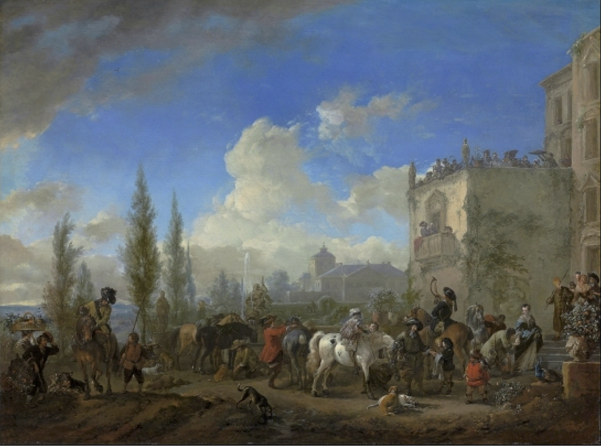

```{r setup, include = FALSE}
options(dplyr.print_min = 6, dplyr.print_max = 6)

knitr::opts_chunk$set(
  fig.width = 8, 
  fig.asp = 0.618,
  out.width = "60%",
  fig.align = "center",
  dpi = 300
  )

ggplot2::theme_set(ggplot2::theme_minimal(base_size = 16))

library(xaringanExtra)
xaringanExtra::use_panelset()

library(countdown)

# output number of lines
hook_output <- knitr::knit_hooks$get("output")
knitr::knit_hooks$set(output = function(x, options) {
  lines <- options$output.lines
  if (is.null(lines)) {
    return(hook_output(x, options))  # pass to default hook
  }
  x <- unlist(strsplit(x, "\n"))
  more <- "..."
  if (length(lines)==1) {        # first n lines
    if (length(x) > lines) {
      # truncate the output, but add ....
      x <- c(head(x, lines), more)
    }
  } else {
    x <- c(more, x[lines], more)
  }
  # paste these lines together
  x <- paste(c(x, ""), collapse = "\n")
  hook_output(x, options)
})
```

layout: true
  
<div class="my-footer">
<span>
<a href="https://bit.ly/tidymodels-uscots21" target="_blank">bit.ly/tidymodels-uscots21</a>
</span>
</div> 

---

```{r packages, echo=FALSE, message=FALSE, warning=FALSE}
library(tidyverse)
library(emo)
```

class: middle, inverse

## .larger[.dark-blue[.hand[Welcome]]]

---

class: middle

```{r out.width="50%", echo=FALSE}

```

.center[
.large[
One link for all materials

🔗 [bit.ly/tidymodels-uscots21](https://bit.ly/tidymodels-uscots21)
]]

---

.center[
.pull-left[
```{r out.width="60%", echo=FALSE}
knitr::include_graphics("images/mine.png")
```
Mine Çetinkaya-Rundel <br>
Duke University, RStudio
]
.pull-right[
```{r out.width="60%", echo=FALSE}
knitr::include_graphics("images/debbie.png")
```
Debbie Yuster <br>
Ramapo College
]
]

.center[
```{r out.width="11%", echo = FALSE, align = "right"}
knitr::include_graphics("images/julia.png")
```
Julia Silge  
RStudio
]

---

class: middle, inverse

## .larger[.dark-blue[.hand[Hello tidymodels]]]

---

class: middle

# High level view: tidymodels

---

class: middle

.pull-left[
```{r out.width="100%", echo=FALSE}
knitr::include_graphics("images/hello-tidymodels.png")
```
]
.pull-right[
The **tidymodels** framework is a collection of packages for modeling and machine learning using tidyverse principles.

```{r eval = FALSE}
install.packages("tidymodels")
```
]

---

.small[
```{r}
library(tidymodels)
```
]

---

```{r out.width="95%", echo=FALSE}
knitr::include_graphics("images/tidymodels.png")
```

---

## Plan

1. First, let's talk about **syntax**
2. Then, a little bit on **motivation**
3. And finally **pedagogy**

---

class: middle

# Syntax

---

## Data: Paris Paintings

- Source: Printed catalogs of 28 auction sales in Paris, 1764 - 1780
- 3,393 paintings, their prices, and descriptive details from sales catalogs - over 60 variables

.small[
```{r load-pp, message = FALSE, output.lines = 12}
pp <- read_csv("data/paris-paintings.csv", na = c("n/a", "", "NA"))
pp
```
]

---

## Observation: Depart pour la chasse

.pull-left[
```{r out.width="65%", echo=FALSE}
knitr::include_graphics("images/auction-catalogue.png")
```
]
.pull-right[
```{r out.width="58%", echo=FALSE}

```
.small[
Two paintings very rich in composition, of a beautiful execution, and whose merit is very remarkable, each 17 inches 3 lines high, 23 inches wide; the first, painted on wood, comes from the Cabinet of Madame la Comtesse de Verrue; it represents a departure for the hunt: it shows in the front a child on a white horse, a man who gives the horn to gather the dogs, a falconer and other figures nicely distributed across the width of the painting; two horses drinking from a fountain; on the right in the corner a lovely country house topped by a terrace, on which people are at the table, others who play instruments; trees and fabriques pleasantly enrich the background.
]
]

---

## Observation: Depart pour la chasse

```{r results="hide"}
pp %>%
  filter(name == "R1777-89a") %>%
  glimpse()
```

.small[
.pull-left[
```{r output.lines=23, echo=FALSE}
pp %>%
  filter(name == "R1777-89a") %>%
  glimpse()
```
]
.pull-right[
```{r output.lines=24:44, echo=FALSE}
pp %>%
  filter(name == "R1777-89a") %>%
  glimpse()
```
]
]

---

## Linear regression, two ways

- **Goal:** Predict height of painting (`Height_in`) from width (`Width_in`)

- **Approach:**
  1. Using base R
  2. Using tidymodels

---

## Approach 1. Base R

- Fit:

```{r}
base_lm <- lm(Height_in ~ Width_in, data = pp)
```

--

- Summarize:

```{r, output.lines = 9:15}
summary(base_lm)
```

---

## Approach 2. Tidymodels

- Fit:

```{r}
tidy_lm <- linear_reg() %>%
  set_engine("lm") %>%
  fit(Height_in ~ Width_in, data = pp)
```

--

- Summarize:

```{r}
tidy(tidy_lm)
```

---

class: middle

.large[
.hand[Let's rewind and redo, step-by-step, with tidymodels]
]

---

## Step 1: Specify model

```{r}
linear_reg()
```

---

## Step 2: Set model fitting *engine*

```{r}
linear_reg() %>%
  set_engine("lm") # lm: linear model
```

---

## Step 3: Fit model & estimate parameters

... using **formula syntax**

```{r fit-model}
linear_reg() %>%
  set_engine("lm") %>%
  fit(Height_in ~ Width_in, data = pp)
```

---

## Step 4: Summarize model output

```{r summarise-model}
linear_reg() %>%
  set_engine("lm") %>%
  fit(Height_in ~ Width_in, data = pp) %>%
  tidy()
```

---

## Linear regression, two ways

### Side-by-side comparison

.pull-left[
Base R:

.small[
```{r}
lm(Height_in ~ Width_in, data = pp) %>%
  summary()
```
]]

.pull-right[
Tidymodels:

.small[
```{r}
linear_reg() %>%
  set_engine("lm") %>%
  fit(Height_in ~ Width_in, data = pp) %>%
  tidy()
```
]]

---

## A note on summarizing model output

- Models fit with base R can be summarized with `tidy()` as well
- So you don't have to use the full tidymodels pipeline to benefit from the *tidy* output

.pull-left[
Base R:

.small[
```{r}
lm(Height_in ~ Width_in, data = pp) %>%
  tidy()
```
]]

.pull-right[
Tidymodels:

.small[
```{r}
linear_reg() %>%
  set_engine("lm") %>%
  fit(Height_in ~ Width_in, data = pp) %>%
  tidy()
```
]]

---

## Tidy regression output

Achieved with functions from the `broom` package:

- `tidy`: Constructs a data frame that summarizes the model's statistical findings: coefficient estimates, *standard errors, test statistics, p-values*.

- `glance`: Constructs a concise one-row summary of the model. This typically contains values such as $R^2$, adjusted $R^2$, *and residual standard errors that are computed once for the entire model*.

- `augment`: Adds columns to the original data that was modeled. This includes predictions and residuals.

---

## Comparison: `glance()`

**They're the same!**

.pull-left[
Base R fit + `glance()`:

.xsmall[
```{r glance-base}
glance(base_lm)
glance(base_lm)$r.squared
```
]]

.pull-right[
Tidymodels fit + `glance()`:

.xsmall[
```{r glance-tidy}
glance(tidy_lm)
glance(tidy_lm)$r.squared
```
]]

---

## Comparison: `augment()`

**They're not exactly the same!**

.pull-left[
Base R fit + `augment()`:

.small[
```{r augment-base}
base_lm_aug <- augment(base_lm)
base_lm_aug
```
]]

.pull-right[
Tidymodels fit + `augment()`:

.small[
```{r augment-tidy}
tidy_lm_aug <- augment(tidy_lm$fit)
tidy_lm_aug
```
]]

---

class: middle

# Motivation

---

## Provide similar interfaces to models

- Q: How do you define the the number of trees when fitting a random forest model?

--
- A: Depends on the package: `randomForest::randomForest()` uses `ntree`, `ranger::ranger()` uses `num.trees`, Spark's `sparklyr::ml_random_forest()` uses `num_trees`.

--
- A, with tidymodels: 

```{r eval = FALSE}
rf_mod <- rand_forest(trees = 2000)
```

---

## Help users avoid pitfalls

<br>

> *"Many models, especially complex predictive or machine learning models, can work very well on the data at hand but may fail when exposed to new data. Often, this issue is due to poor choices made during the development and/or selection of the models. Whenever possible, [tidymodels] software, documentation, and other materials attempt to prevent these and other pitfalls."* [[Source](https://www.tmwr.org/index.html)]

<br>

--
- Tidymodels pipelines start with splitting data into training and testing sets, and facilitate keeping them separate
- Tidymodels is opioniated about which functions can be applied to testing data

---

class: middle

# Pedagogy

---

## For simple `lm`, might hard to see the advantage

.pull-left[
Base R:

.small[
```{r}
lm(Height_in ~ Width_in, data = pp) %>%
  summary()
```
]]

.pull-right[
Tidymodels:

.small[
```{r}
linear_reg() %>%
  set_engine("lm") %>%
  fit(Height_in ~ Width_in, data = pp) %>%
  tidy()
```
]]

---

## Though easier to see the advantage in the summary step

.pull-left[
Base R:

.small[
```{r}
lm(Height_in ~ Width_in, data = pp) %>%
  tidy()
```
]]

.pull-right[
Tidymodels:

.small[
```{r}
linear_reg() %>%
  set_engine("lm") %>%
  fit(Height_in ~ Width_in, data = pp) %>%
  tidy()
```
]]

---

## Pedagogical advantages more clear as you move on to different models

.pull-left[
```{r eval = FALSE}
linear_reg() %>%
  set_engine("lm") %>%
  set_mode("regression")

logistic_reg() %>% 
  set_engine("glm") %>%
  set_mode("classification")

rand_forest() %>% 
  set_engine("ranger") %>% 
  set_mode("regression")

decision_tree() %>% 
  set_engine("rpart") %>% 
  set_mode("regression")

...
```
]

--
.pull-right[
```{r eval = TRUE}
svm_linear() %>% 
  set_engine("LiblineaR") %>% 
  set_mode("regression") 

svm_linear() %>% 
  set_engine("LiblineaR") %>% 
  set_mode("classification")
```
]

---

## Build on dplyr pipelines to build recipes

.pull-left[
```{r eval=FALSE}
email %>%
  select(-from, -sent_email) %>%
  mutate(
    day_of_week = lubridate::wday(time),
    month = lubridate::month(time)
  ) %>%
  select(-time) %>%
  mutate(
    cc = cut(cc, breaks = c(0, 1)),
    attach = cut(attach, breaks = c(0, 1)),
    dollar = cut(dollar, breaks = c(0, 1))
  ) %>%
  mutate(
    inherit = cut(inherit, breaks = c(0, 1, 5, 10, 20)),
    password = cut(password, breaks = c(0, 1, 5, 10, 20))
  ) %>%
  ...
```
]

--
.pull-right[
```{r eval=FALSE}
recipe(spam ~ ., data = email) %>%
  step_rm(from, sent_email) %>%
  step_date(
    time, 
    features = c("dow", "month")
    ) %>%
  step_rm(time) %>%
  step_cut(
    cc, 
    attach, 
    dollar, breaks = c(0, 1)
    ) %>%
  step_cut(
    inherit, 
    password, breaks = c(0, 1, 5, 10, 20)
    ) %>%
  ...
```
]

---

class: middle, inverse

## .larger[.dark-blue[.hand[Case studies]]]

---

class: middle

# Case study 1: Predicting book weights

.hand[Keeping it simple to begin!]

---

## Data: Book weight and volume

The `allbacks` data frame gives measurements on the volume and weight of 15 books, some of which are paperback and some of which are hardback (a.k.a. hardcover)

.pull-left[
- Volume - cubic centimeters
- Area - square centimeters
- Weight - grams
]
.pull-right[
.small[
```{r echo=FALSE}
library(DAAG)
as_tibble(allbacks) %>%
  print(n = 15)
```
]
]

.footnote[
.small[
These books are from the bookshelf of J. H. Maindonald at Australian National University.
]
]

---

## Book weight vs. volume

```{r out.width = "75%", echo = FALSE}
ggplot(allbacks, aes(x = volume, y = weight)) +
  geom_point(alpha = 0.7, size = 3)
```

---

## Book weight vs. volume and cover

```{r out.width = "75%", echo = FALSE}
ggplot(allbacks, aes(x = volume, y = weight, color = cover, shape = cover)) +
  geom_point(alpha = 0.7, size = 3) +
  theme(legend.position = "bottom") +
  scale_color_manual(values = c("#E48957", "#071381"))
```

---

class: middle

.your-turn[
**Your turn:** Let's fit a simple multiple linear regression model!

- Go to RStudio Cloud: INSERT LINK
- Join the space and click on **Projects** on top
- **Start** the project titled **Books**
- Open the R Markdown document called `books.Rmd` and follow the instructions
]

```{r echo = FALSE}
countdown(minutes = 10)
```

---

class: middle

# Case study 2: Predicting spam

.hand[Leveraging (much of) the tidymodels framework to continue...]

---

## Spam filters

.pull-left-narrow[
- Data from 3921 emails and 21 variables on them
- Outcome: whether the email is spam or not
- Predictors: number of characters, whether the email had "Re:" in the subject, time at which email was sent, number of times the word "inherit" shows up in the email, etc.
]
.pull-right-wide[
.small[
```{r}
library(openintro)
glimpse(email)
```
]
]

---

class: middle

.large[
.hand[first we warm the students up to the data...]
]

---

.question[
Would you expect longer or shorter emails to be spam?
]

--

.pull-left[
```{r echo=FALSE, out.width="100%"}
library(ggridges)
email %>%
  ggplot(aes(x = num_char, y = spam, fill = spam, color = spam)) +
  geom_density_ridges2(alpha = 0.5) +
  labs(
    x = "Number of characters (in thousands)", 
    y = "Spam",
    title = "Spam vs. number of characters"
    ) +
  guides(color = FALSE, fill = FALSE) +
  scale_fill_manual(values = c("#E48957", "#CA235F")) +
  scale_color_manual(values = c("#DEB4A0", "#CA235F"))
```
]
.pull-right[
```{r echo=FALSE}
email %>% 
  group_by(spam) %>% 
  summarise(mean_num_char = mean(num_char))
```
]

---

.question[
Would you expect emails that have subjects starting with "Re:", "RE:", "re:", or "rE:" to be spam or not?
]

--

```{r echo=FALSE}
email %>%
  ggplot(aes(x = re_subj, fill = spam)) +
  geom_bar(position = "fill") +
  labs(
    x = 'Whether “re:”, "RE:", etc. was in the email subject.', 
    fill = "Spam", 
    y = NULL,
    title = 'Spam vs. "re:" in subject'
    ) +
  scale_fill_manual(values = c("#DEB4A0", "#CA235F"))
```

---

class: middle

.large[
.hand[then we introduce logistic regression and generalized linear models (GLMs) in general, build a few logistic regression models with one or two predictors, interpret results...]
]

---

## Predicting spam

.panelset[
.panel[.panel-name[Output]
.small[
```{r ref.label = "spam-mlr", echo = FALSE, warning = FALSE}
```
]
]
.panel[.panel-name[Code]
```{r spam-mlr, results = "hide"}
logistic_reg() %>%
  set_engine("glm") %>%
  fit(spam ~ ., data = email, family = "binomial") %>%
  tidy() %>%
  print(n = 22)
```
]
]

---

## Prediction

- The mechanics of prediction is **easy**:
  - Plug in values of predictors to the model equation
  - Calculate the predicted value of the response variable, $\hat{y}$

--
- Getting it right is **hard**!
  - There is no guarantee the model estimates you have are correct
  - Or that your model will perform as well with new data as it did with your sample data

---

## Spending our data

- Several steps to create a useful model: parameter estimation, model selection, performance assessment, etc.

- Doing all of this on the entire data we have available can lead to **overfitting**

- Allocate specific subsets of data for different tasks, as opposed to allocating the largest possible amount to the model parameter estimation only (which is what we've done so far)

---

## Splitting data

- **Training set:**
  - Sandbox for model building 
  - Spend most of your time using the training set to develop the model
  - Majority of the data (usually 80%)
  
- **Testing set:**
  - Held in reserve to determine efficacy of one or two chosen models
  - Critical to look at it once, otherwise it becomes part of the modeling process
  - Remainder of the data (usually 20%)
  
---

## Performing the split

```{r}
# Fix random numbers by setting the seed 
# Enables analysis to be reproducible when random numbers are used 
set.seed(1116)

# Put 80% of the data into the training set 
email_split <- initial_split(email, prop = 0.80)

# Create data frames for the two sets:
train_data <- training(email_split)
test_data  <- testing(email_split)
```

---

## Peek at the split

.small[
.pull-left[
```{r}
glimpse(train_data)
```
]
.pull-right[
```{r}
glimpse(test_data)
```
]
]

---

## Feature engineering

- We prefer simple models when possible, but **parsimony** does not mean sacrificing accuracy (or predictive performance) in the interest of simplicity

--
- Variables that go into the model and how they are represented are just as critical to success of the model

--
- **Feature engineering** allows us to get creative with our predictors in an effort to make them more useful for our model (to increase its predictive performance) 

---

## A simple approach: `mutate()`

```{r message=FALSE}
library(lubridate)

train_data %>%
  mutate(
    date = date(time),
    dow  = wday(time),
    month = month(time)
    ) %>%
  select(time, date, dow, month) %>%
  sample_n(size = 5) # shuffle to show a variety
```

---

## Modeling workflow, revisited

- Create a **recipe** for feature engineering steps to be applied to the training data

--
- Fit the model to the training data after these steps have been applied

--
- Using the model estimates from the training data, predict outcomes for the test data

--
- Evaluate the performance of the model on the test data

---

## You gotta keep them separated!

- We might not want to use the data we have as is

- We might want to "engineer features", omit certain variables, etc.

- And we need a way of doing this in a way that can be applied to both training and testing data, ideally without making us do extra work

- Enter **recipes** to help with this!

---

## Initiate a recipe

```{r initiate-recipe, results="hide"}
email_rec <- recipe(
  spam ~ .,          # formula
  data = train_data  # data to use for cataloguing names and types of variables
  )

summary(email_rec)
```

.xsmall[
```{r echo=FALSE}
summary(email_rec) %>% print(n = 21)
```
]

---

## Remove certain variables

```{r}
email_rec <- email_rec %>%
  step_rm(from, sent_email)
```

.small[
```{r echo=FALSE}
email_rec
```
]

---

## Feature engineer date

```{r}
email_rec <- email_rec %>%
  step_date(time, features = c("dow", "month")) %>%
  step_rm(time)
```

.small[
```{r echo=FALSE}
email_rec
```
]

---

## Discretize numeric variables

```{r}
email_rec <- email_rec %>%
  step_cut(cc, attach, dollar, breaks = c(0, 1)) %>%
  step_cut(inherit, password, breaks = c(0, 1, 5, 10, 20))
```

.small[
```{r echo=FALSE}
email_rec
```
]

---

## Create dummy variables

```{r}
email_rec <- email_rec %>%
  step_dummy(all_nominal(), -all_outcomes())
```

.small[
```{r echo=FALSE}
email_rec
```
]

---

## Remove zero variance variables

Variables that contain only a single value

```{r}
email_rec <- email_rec %>%
  step_zv(all_predictors())
```

.small[
```{r echo=FALSE}
email_rec
```
]

---

## All in one place

```{r}
email_rec <- recipe(spam ~ ., data = email) %>%
  step_rm(from, sent_email) %>%
  step_date(time, features = c("dow", "month")) %>%               
  step_rm(time) %>%
  step_cut(cc, attach, dollar, breaks = c(0, 1)) %>%
  step_cut(inherit, password, breaks = c(0, 1, 5, 10, 20)) %>%
  step_dummy(all_nominal(), -all_outcomes()) %>%
  step_zv(all_predictors())
```

---

## What's next?

- We have our data split into testing and training
- We know the recipe steps we want to apply to our testing and training data
- We now need to define the model to fit and collect model results
- Lots of bookkeeping is needed to make sure we're not training our model on testing data
- Enter **workflows** to help with this!

---

## Define model

```{r}
email_mod <- logistic_reg() %>% 
  set_engine("glm")

email_mod
```

---

## Define workflow

**Workflows** bring together models and recipes so that they can be easily applied to both the training and test data.

```{r}
email_wflow <- workflow() %>% 
  add_model(email_mod) %>% 
  add_recipe(email_rec)
```

.small[
```{r echo=FALSE}
email_wflow
```
]

---

## Fit model to training data

```{r warning = FALSE}
email_fit <- email_wflow %>% 
  fit(data = train_data)
```

---

.small[
```{r}
tidy(email_fit) %>% print(n = 31)
```
]

---

## Make predictions for test data

```{r warning = FALSE}
email_pred <- predict(email_fit, test_data, type = "prob") %>% 
  bind_cols(test_data) 

email_pred
```

---

## Evaluate the performance

.pull-left[
```{r roc-again, fig.show="hide"}
email_pred %>%
  roc_curve(
    truth = spam,
    .pred_1,
    event_level = "second"
  ) %>%
  autoplot()
```
]
.pull-right[
```{r ref.label="roc-again", echo=FALSE, out.width="100%"}
```
]

---

## Evaluate the performance

.pull-left[
```{r}
email_pred %>%
  roc_auc(
    truth = spam,
    .pred_1,
    event_level = "second"
  )
```
]
.pull-right[
```{r ref.label="roc-again", echo=FALSE, out.width="100%"}
```
]

---

class: middle

.large[
.hand[and we could keep going with performing cross validation, and much more...]
]

---

class: middle, inverse

## .larger[.dark-blue[.hand[Wrap up]]]

---

class: middle

# What about inference?

---

## Suppose...

Estimate the difference between the average evaluation score of male and female faculty.

.midi[
```{r message = FALSE}
library(openintro)
evals %>%
  select(score, rank, ethnicity, gender, bty_avg)
```
]

---

.pull-left[
.midi[
```{r cache=TRUE}
evals %>%
  specify(score ~ gender) %>%
  generate(reps = 1000, 
    type = "bootstrap") %>%
  calculate(stat = "diff in means", 
    order = c("male", "female")) %>%
  summarise(
    l = quantile(stat, 0.025), 
    u = quantile(stat, 0.975)
    )
```
]
]
.pull-right[
.midi[
```{r}
t.test(evals$score ~ evals$gender)
```
]
]

---

## infer $\in$ tidymodels

.pull-left[
The objective of **infer** is to perform statistical inference using an expressive statistical grammar that coheres with the tidyverse design framework.
]
.pull-right[
```{r echo=FALSE, fig.alt = "Hex sticker for the infer package."}

```
]

---

.midi[
```{r infer-1}
evals %>%
  specify(score ~ gender)
```
]

---

.midi[
```{r infer-2, cache=TRUE}
set.seed(1234)
evals %>%
  specify(score ~ gender) %>%
  generate(reps = 1000, type = "bootstrap")
```
]

---

.midi[
```{r infer-3, cache=TRUE}
set.seed(1234)
evals %>%
  specify(score ~ gender) %>%
  generate(reps = 1000, type = "bootstrap") %>%
  calculate(stat = "diff in means", order = c("male", "female"))
```
]

---

.midi[
```{r infer-4, cache=TRUE, out.width = "60%"}
set.seed(1234)
evals %>%
  specify(score ~ gender) %>%
  generate(reps = 1000, type = "bootstrap") %>%
  calculate(stat = "diff in means", order = c("male", "female")) %>%
  visualise()
```
]

---

.midi[
```{r infer-5, cache=TRUE}
set.seed(1234)
evals %>%
  specify(score ~ gender) %>%
  generate(reps = 1000, type = "bootstrap") %>%
  calculate(stat = "diff in means", order = c("male", "female")) %>%
  summarise(l = quantile(stat, 0.025), u = quantile(stat, 0.975))
```
]

---

## Learning resources

.large[
`r emo::ji("chequered_flag")` **Get started** with tidymodels: [tidymodels.org/start](https://www.tidymodels.org/start/)

`r emo::ji("page_facing_up")` **Learn** more and go further: [tidymodels.org/learn](https://www.tidymodels.org/learn/)

`r emo::ji("blue_book")` **Tidy Modeling with R** by Max Kuhn & Julia Silge: [tmwr.org](https://www.tmwr.org/)
]

---

## Teaching resources

**Data Science in a Box** ([datasciencebox.org](https://datasciencebox.org/)) contains slides, application exercises, computing labs, and homework assignments on modelling and inference with tidymodels:

.midi[
- Slides and application exercises:
  - [Modelling data](https://datasciencebox.org/making-rigorous-conclusions.html#modelling-data)
  - [Classification and model building](https://datasciencebox.org/making-rigorous-conclusions.html#classification-and-model-building)
  - [Model validation](https://datasciencebox.org/making-rigorous-conclusions.html#model-validation)
  - [Uncertainty quantification](https://datasciencebox.org/making-rigorous-conclusions.html#uncertainty-quantification)
- [Labs](https://datasciencebox.org/making-rigorous-conclusions.html#labs-2)
  - Grading the professor: Fitting and interpreting simple linear regression models
  - Smoking while pregnant: Constructing confidence intervals, conducting hypothesis tests, and interpreting results in context of the data
- [Homework assignments](https://datasciencebox.org/making-rigorous-conclusions.html#homework-assignments-1):
  - Bike rentals in DC: Exploratory data analysis and fitting and interpreting models
  - Exploring the GSS: Fitting and interpreting models
  - Modelling the GSS: Model validation and inference
]

---

class: center, middle

.huge[
.hand[thank you!]
]

.large[
🔗 [bit.ly/tidymodels-uscots21](https://bit.ly/tidymodels-uscots21)
]
