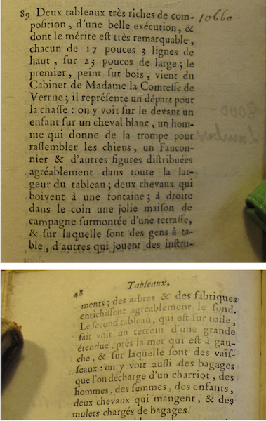
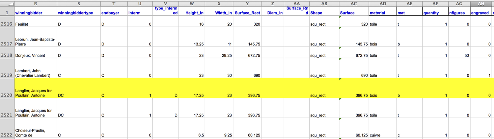

```{r setup, include = FALSE}
options(dplyr.print_min = 6, dplyr.print_max = 6)

knitr::opts_chunk$set(
  fig.width = 8, 
  fig.asp = 0.618,
  out.width = "60%",
  fig.align = "center",
  dpi = 300
  )

ggplot2::theme_set(ggplot2::theme_minimal(base_size = 16))

library(xaringanExtra)
xaringanExtra::use_panelset()

# output number of lines
hook_output <- knitr::knit_hooks$get("output")
knitr::knit_hooks$set(output = function(x, options) {
  lines <- options$output.lines
  if (is.null(lines)) {
    return(hook_output(x, options))  # pass to default hook
  }
  x <- unlist(strsplit(x, "\n"))
  more <- "..."
  if (length(lines)==1) {        # first n lines
    if (length(x) > lines) {
      # truncate the output, but add ....
      x <- c(head(x, lines), more)
    }
  } else {
    x <- c(more, x[lines], more)
  }
  # paste these lines together
  x <- paste(c(x, ""), collapse = "\n")
  hook_output(x, options)
})
```

layout: true
  
<div class="my-footer">
<span>
<a href="https://bit.ly/tidymodels-uscots21" target="_blank">bit.ly/tidymodels-uscots21</a>
</span>
</div> 

---

```{r packages, echo=FALSE, message=FALSE, warning=FALSE}
library(tidyverse)
library(emo)
library(tidymodels)

```

## Welcome

- Introductions...
- Useful links

TO DO: Need to update hex for logo for workshop...

---

```{r out.width="98%", echo=FALSE}
knitr::include_graphics("images/tidymodels.png")
```

---

class: middle

# High level view: tidymodels

---

## With basic model fit (lm) alone, no advantage

Not necessarily better way to do any linear model, better as a framework in general

---

class: middle

# Linear regression done two ways

---

## Paris Paintings
### Meet the data curators

.center[
 

Sandra van Ginhoven &nbsp; &nbsp; Hilary Coe Cronheim

PhD students in the Duke Art, Law, and Markets Initiative in 2013
]

- Source: Printed catalogs of 28 auction sales in Paris, 1764 - 1780
- 3,393 paintings, their prices, and descriptive details from sales catalogs - over 60 variables
---

## Depart pour la chasse

```{r out.width="65%", echo=FALSE}
knitr::include_graphics("images/depart-pour-la-chasse.png")
```

---

## Auction catalog text

.pull-left[
```{r out.width="65%", echo=FALSE}

```
]
.pull-right[
.small[
Two paintings very rich in composition, of a beautiful execution, and whose merit is very remarkable, each 17 inches 3 lines high, 23 inches wide; the first, painted on wood, comes from the Cabinet of Madame la Comtesse de Verrue; it represents a departure for the hunt: it shows in the front a child on a white horse, a man who gives the horn to gather the dogs, a falconer and other figures nicely distributed across the width of the painting; two horses drinking from a fountain; on the right in the corner a lovely country house topped by a terrace, on which people are at the table, others who play instruments; trees and fabriques pleasantly enrich the background.
]
]

---

```{r out.width = "65%", echo=FALSE}
knitr::include_graphics("images/painting1.png")

knitr::include_graphics("images/painting3.png")
```

---

## Minor detail: load data

```{r load-pp, message = FALSE, output.lines = 15}
pp <- read_csv("data/paris-paintings.csv", na = c("n/a", "", "NA"))
pp
```

---

## Linear regression, two ways

- **Goal:** Predict height of painting (`Height_in`) from width (`Width_in`)

- **Approach:**
  1. Using base R
  2. Using tidymodels

---

## Approach 1. Base R

- Fit:

```{r}
base_lm <- lm(Height_in ~ Width_in, data = pp)
```

--

- Summarise:

```{r, output.lines = 9:15}
summary(base_lm)
```

---

## Approach 2. Tidymodels

- Fit:

```{r}
tidy_lm <- linear_reg() %>%
  set_engine("lm") %>%
  fit(Height_in ~ Width_in, data = pp)
```

--

- Summarise:

```{r}
tidy(tidy_lm)
```

---

class: middle

.hand[Let's rewind and redo, step-by-step, with tidymodels]

---

## Step 1: Specify model

```{r}
linear_reg()
```

---

## Step 2: Set model fitting *engine*

```{r}
linear_reg() %>%
  set_engine("lm") # lm: linear model
```

---

## Step 3: Fit model & estimate parameters

... using **formula syntax**

```{r fit-model}
linear_reg() %>%
  set_engine("lm") %>%
  fit(Height_in ~ Width_in, data = pp)
```

---

## Step 4: Summarise model output

```{r summarise-model}
linear_reg() %>%
  set_engine("lm") %>%
  fit(Height_in ~ Width_in, data = pp) %>%
  tidy()
```

---

## Linear regression, two ways

### Side-by-side comparison

.pull-left[
Base R:

.small[
```{r}
lm(Height_in ~ Width_in, data = pp) %>%
  summary()
```
]]

.pull-right[
Tidymodels:

.small[
```{r}
linear_reg() %>%
  set_engine("lm") %>%
  fit(Height_in ~ Width_in, data = pp) %>%
  tidy()
```
]]

---

## A note on summarising model output

- Models fit with base R can be summarised with `tidy()` as well
- So you don't have to use the full tidymodels pipeline to benefit from the *tidy* output

.pull-left[
Base R:

.small[
```{r}
lm(Height_in ~ Width_in, data = pp) %>%
  tidy()
```
]]

.pull-right[
Tidymodels:

.small[
```{r}
linear_reg() %>%
  set_engine("lm") %>%
  fit(Height_in ~ Width_in, data = pp) %>%
  tidy()
```
]]

---

## Tidy regression output

Achieved with functions from the `broom` package:

- `tidy`: Constructs a data frame that summarizes the model's statistical findings: coefficient estimates, *standard errors, test statistics, p-values*.

- `glance`: Constructs a concise one-row summary of the model. This typically contains values such as $R^2$, adjusted $R^2$, *and residual standard errors that are computed once for the entire model*.

- `augment`: Adds columns to the original data that was modeled. This includes predictions and residuals.

---

## Comparison: `glance()`

**They're the same!**

.pull-left[
Base R fit + `glance()`:

.small[
```{r glance-base}
glance(base_lm)
glance(base_lm)$r.squared
```
]]

.pull-right[
Tidymodels fit + `glance()`:

.small[
```{r glance-tidy}
glance(tidy_lm)
glance(tidy_lm)$r.squared
```
]]

---

## Comparison: `augment()`

**They're not exactly the same!**

.pull-left[
Base R fit + `glance()`:

.small[
```{r augment-base}
base_lm_aug <- augment(base_lm)
base_lm_aug
```
]]

.pull-right[
Tidymodels fit + `augment()`:

.small[
```{r augment-tidy}
tidy_lm_aug <- augment(tidy_lm$fit)
tidy_lm_aug
```
]]

---

## Preprocess training and testing data together, recipes as a big picture

---

## Split into training/testing first

---

class: middle

# Case study 1: Linear, simple...

---

MLR example without recipes

- fit model
- prediction
- breakout room: 10 min
		
---

class: middle

# Case study 2: Logistic, more complex...

---

cross validation, autoplot

---

class: middle

# Wrap up

---

## What about inference?

---

## Resources from dsbox

---

class: center, middle

.hand[thank you!]

TO DO: ADD LINKS AGAIN

